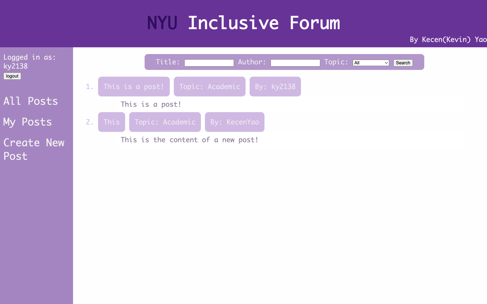
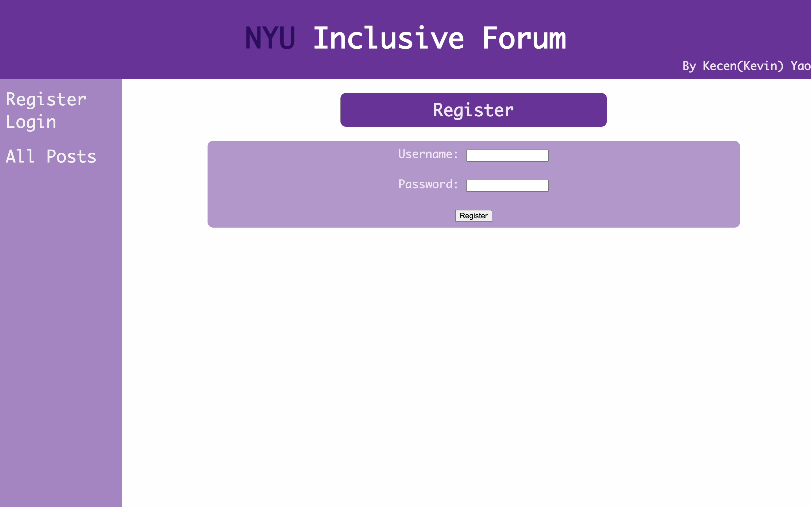
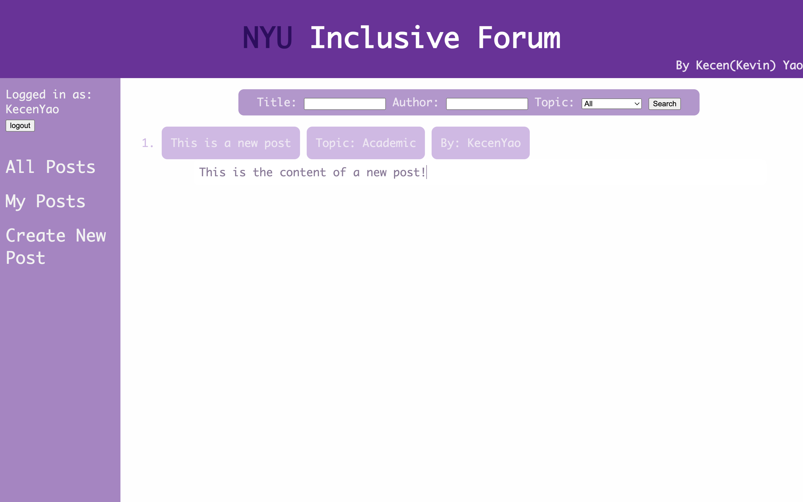
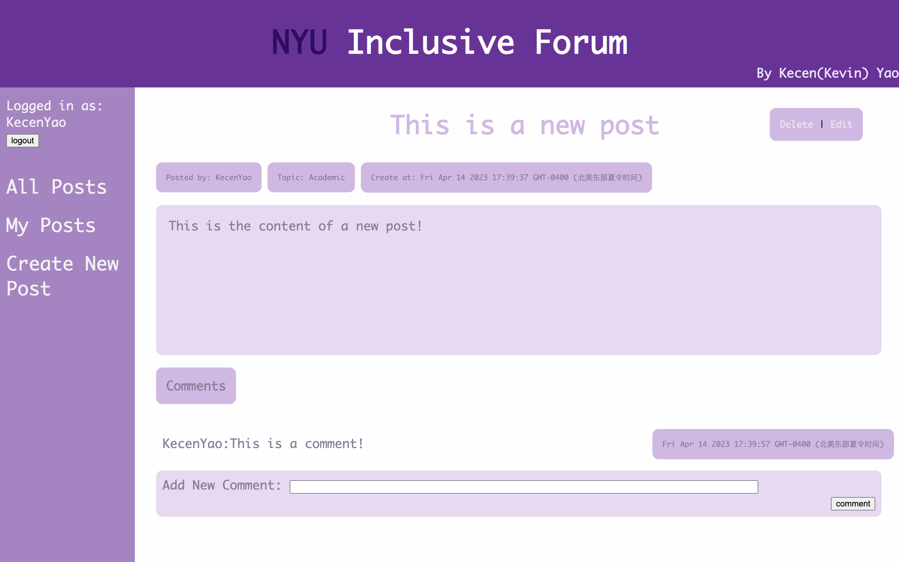
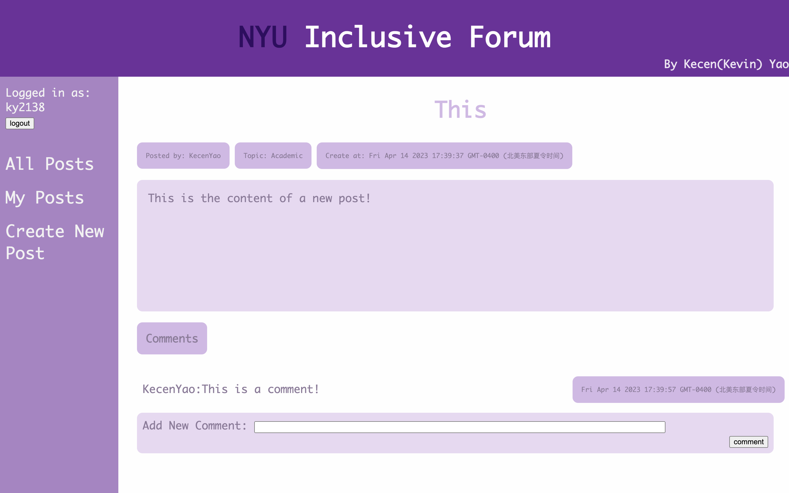
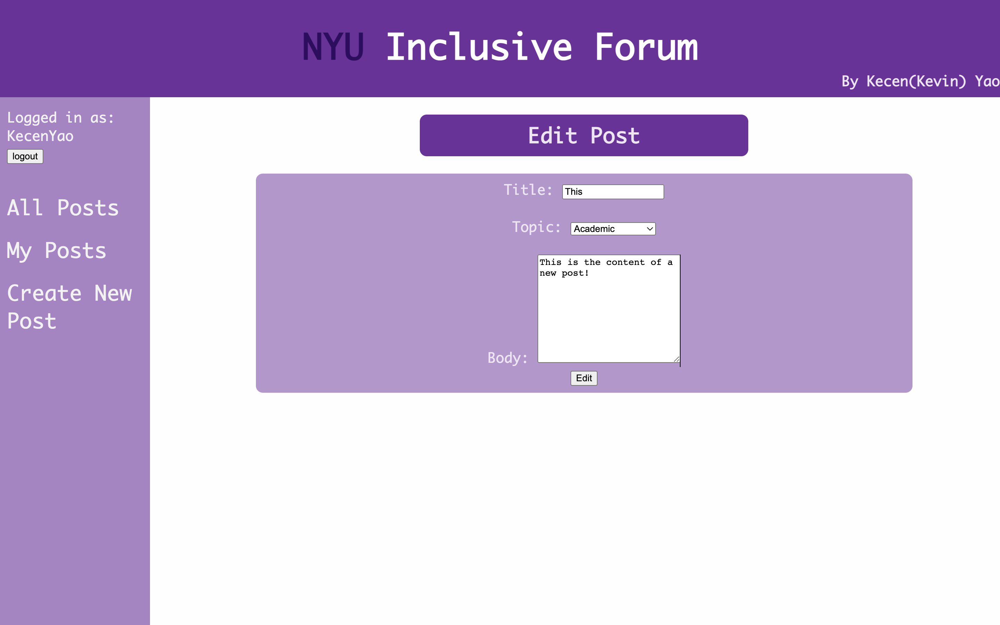
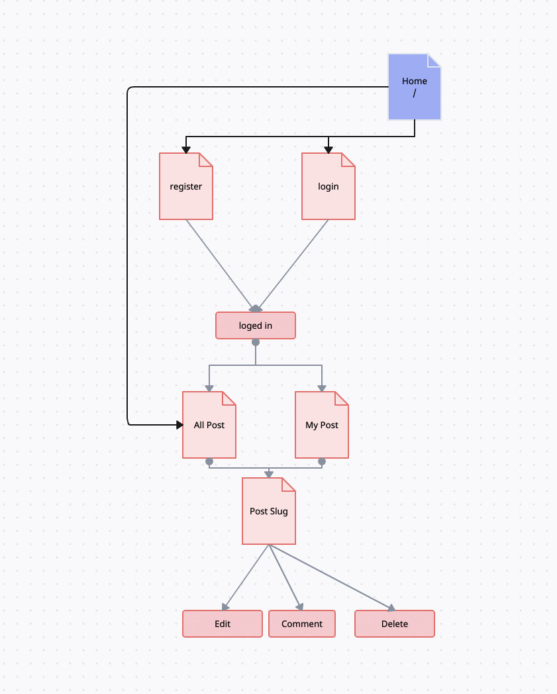

# NYU Inclusive Forum

## Overview
Have you ever wonder what to plan for your college life when you first enter NYU but you find no where to ask? The app **NYU Inclusive Forum** is here to help you out!

**NYU Inclusive Forum** is a web app that is a reddit-like forum just for NYU. It will allow users to post their own stories and comment on others post. Users can register and login. Once they're logged in, they can create/delete/edit their post as well as comments on others post. The app also provide a search engine to search for particular post.


## Data Model

The application will store Users, Posts and Comments

* users can have multiple posts (via references)
* each post can have multiple comments (by embedding)

An Example User:

```javascript
{
  username: "NYUer",
  hash: // a password hash,
}
```

An Example Posts with Embedded comment:

```javascript
{
  title: "This is Head",
  body: "This is content", 
  user: User._Id, // a reference to a User object
  comments: [
    { user : "ky2138", 
    content: "This is a comment", 
    createdAt: // timestamp,
    updatedAt: // timestamp
    } 
    ],
  createdAt: // timestamp,
  updatedAt: // timestamp
  slug: "this-is-head"
}
```

An Example Comment:

```javascript
{   
  user : "ky2138", 
  content: "This is a comment", 
  createdAt: // timestamp,
  updatedAt: // timestamp
} 
```
## [Link to Schema](db.mjs) 

## Wireframes
/ - page for showing all post



/register - page for registering a new account



/login - page for logging in


/post/mine - page for showing this account's post




/post/add - page for creating a new post


/post/slug - page for showing specific post

This is the page that show's the post that is from the logged in user. 


This is the page that show's the post that is not from the logged in user. 


/post/slug/edit - page for edit a post



## Site map



## User Stories or Use Cases
1. as non-registered user, I can register a new account with the site
2. as non-registered user, I can log in to the site
3. as non-registered user, I can view all posts
4. as non-registered user, I can search a post
3. as a user, I can view all posts
4. as a user, I can view my posts
5. as a user, I can search a post
5. as a user, I can click in a post to see the post
6. as a user, I can create a new post
7. as a user, I can edit my post
8. as a user, I can delete my post
10. as a user, I can comment on all posts

## Research Topics
* (5 points) Integrate user authentication
    * I'm going to be using passport to achive user authentication.
    * My forum will have a login page where users can login with their username and password. If the user is not registered, they can register a new account.

* (5 points) Automated functional testing for all of my routes using Selenium/headless chrome
    * this will be used to test the functionality of my app
    * I will be using Selenium to test the functionality of my app. I will be testing the login/logout function using 4 test.


## [Link to Main Project File](app.mjs) 

## Annotations / References Used
1. loginradius https://www.loginradius.com/blog/engineering/guest-post/nodejs-authentication-guide/