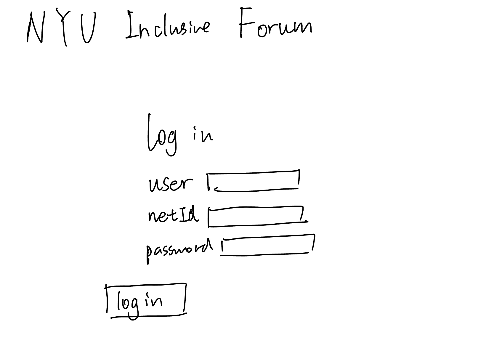
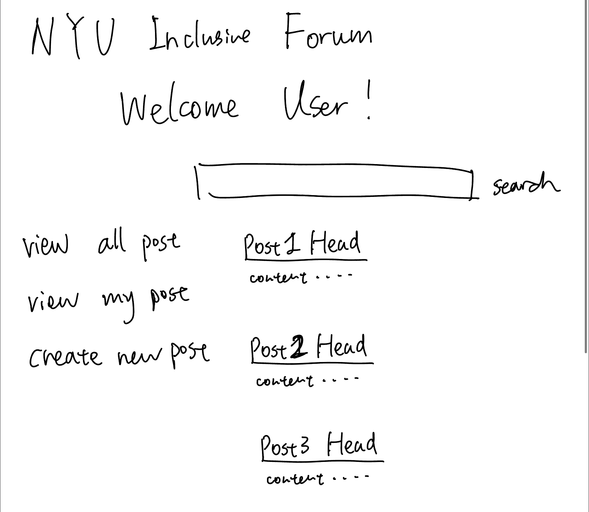
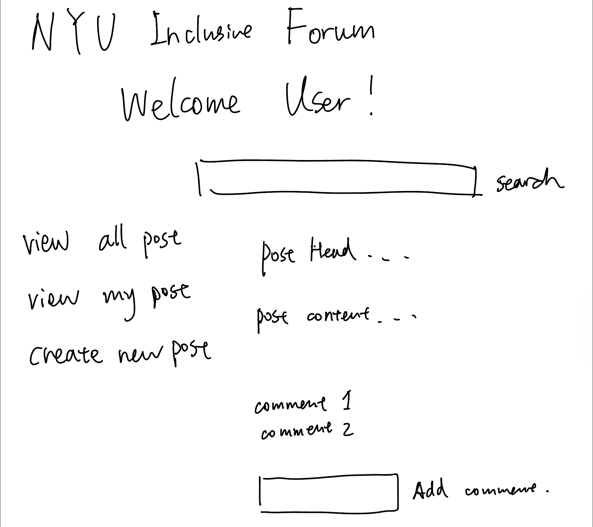
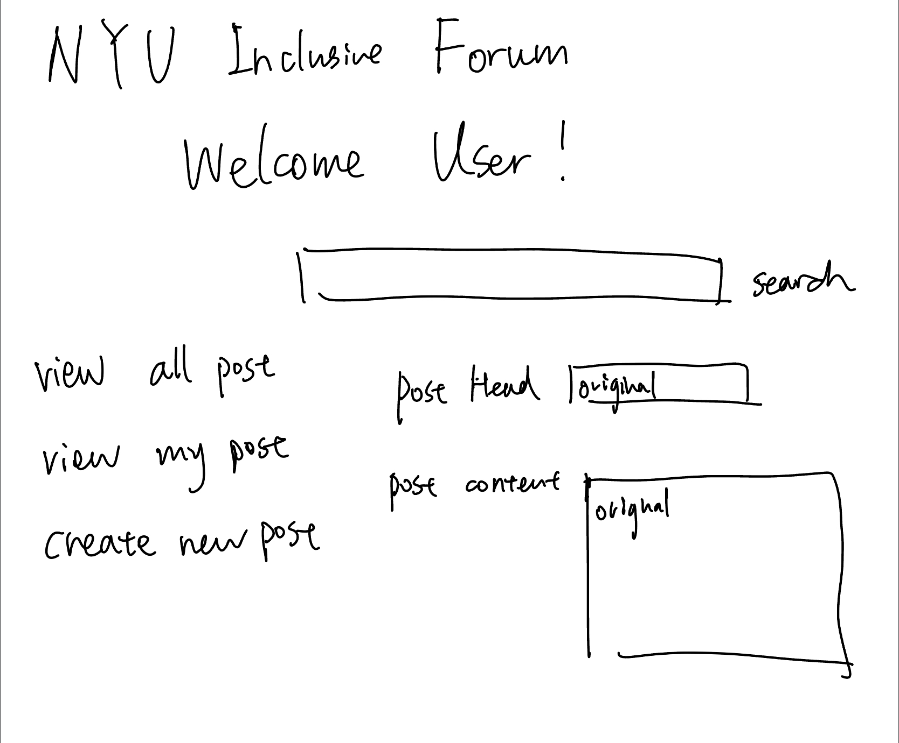
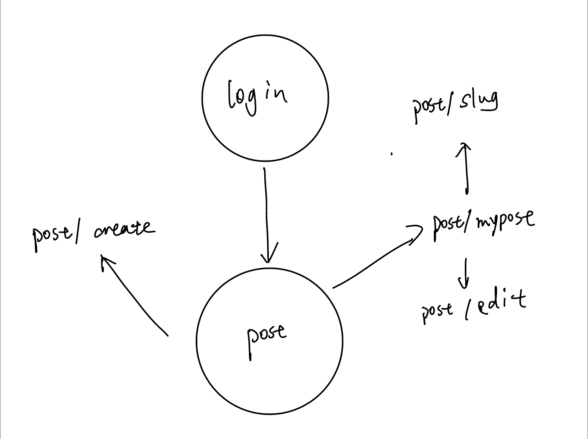

# NYU Inclusive Forum

## Overview
Have you ever wonder what to plan for your college life when you first enter NYU but you find no where to ask? The app **NYU Inclusive Forum** is here to help you out!

**NYU Inclusive Forum** is a web app that is a reddit-like forum just for NYU. It will allow users to post their own stories, comment/like on others post. Users can register and login. Once they're logged in, they can create/delete/edit their post as well as comments on others post. The app also provide a search engine to search for particular post.


## Data Model

The application will store Users, Posts and Comments

* users can have multiple posts (via references)
* each post can have multiple comments (by embedding)

An Example User:

```javascript
{
  username: "NYUer",
  netID: "ky2138",
  hash: // a password hash,
  salt: //a salt value,
  posts: // an array of references to schedules documents
}
```

An Example Posts with Embedded comment:

```javascript
{
  user: UserId, // a reference to a User object
  head: "This is Head",
  content: "This is content", 
  like: 1,
  comments: [
    { netID : "ky2138", content: "This is a comment", createdAt: // timestamp 
    } 
    ],
  createdAt: // timestamp
}
```

An Example Comment:

```javascript
{
  user: UserId,
  body: "Here is a comments",
  date: "2022/10/1",
}
```
## [Link to Commented First Draft Schema](db.mjs) 

## Wireframes
/login - page for logging in



/post - page for showing all post



/post/mypost - page for showing my post


/post/slug - page for showing specific post



/post/create - page for creating a new post


/post/edit - page for edit a post



## Site map



## User Stories or Use Cases
1. as non-registered user, I can register a new account with the site
2. as a user, I can log in to the site
3. as a user, I can view all posts
4. as a user, I can view my posts
5. as a user, I can search a post
6. as a user, I can create a new post
7. as a user, I can edit my post
8. as a user, I can delete my post
9. as a user, I can like/dislike all posts
10. as a user, I can comment on all posts

## Research Topics
* (5 points) Integrate user authentication
I'm going to be using moduels like argon2, passport to achive user authentication

* (5 points) Automated functional testing for all of my routes using Selenium


## [Link to Initial Main Project File](app.mjs) 

## Annotations / References Used
1. loginradius https://www.loginradius.com/blog/engineering/guest-post/nodejs-authentication-guide/